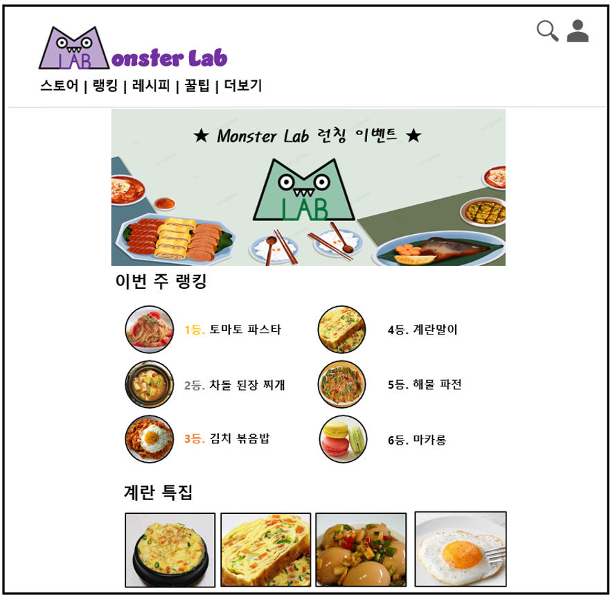

# Monster Lab

## 01. 프로젝트 계획

### 프로젝트 소개

**프로그램명: Monster Lab**

**설명**: 자취를 하는 사람이 증가함에 따라 영향 균형이 잡힌 생활을 제공하는데 도움을 주기 위해 **음식의 레시피를 제공**하고, 그에 따른 **식자재를 선택해서 구매**할 수 있는 웹 사이트를 개발한다.

 

### 구성원

C093299 홍민기 [PM]

C289002 고영훈 [PL]

C289003 김건우[PL]

C284030 이다연

C289039 유승환

C289045 이유림

C289063 최유림

 

### 개발도구

HTML, CSS, JavaScript, React, Node.js, Express, Oracle

 

## 02. 기능적 요구분석

### 회원정보 기능

1. 회원가입
2. 로그인, 로그아웃
3. 회원정보 수정
4. 즐겨찾기 목록 관리
5. 장바구니 관리
6. 레시피 로드맵 (퀘스트 방식)
7. 공지사항, 이벤트, FAQ

 

### 메인 기능 (레시피 열람)

1. 랭킹, 음식분류, 가이드, 추천상품 등을 다양하게 제공
2. 1인분 ~ 4인분 선택: 인분에 따른 재료의 양 출력
3. 칼로리 계산, 출력 기능 추가
4. 알레르리가 있는 재료가 존재하면 경고문구 발생
5. 재료 장바구니에 담기
6. 추천 요리

 

## 03. 프로젝트 설계

### UI 설계

### DB 설계
